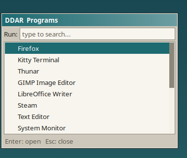
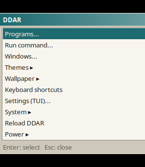
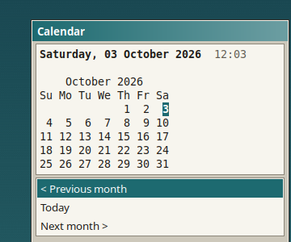
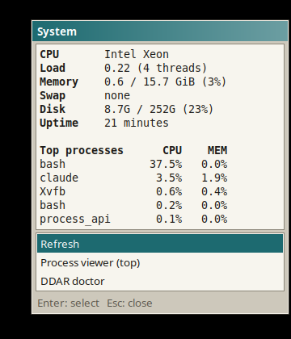
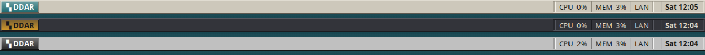
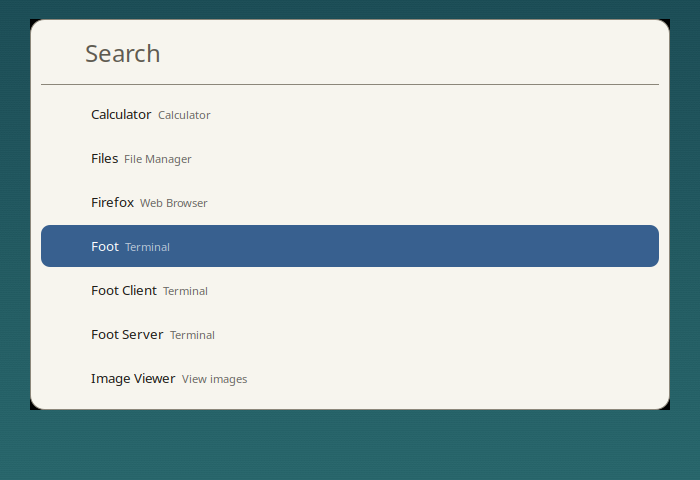

# DDAR — a retro desktop for Hyprland

DDAR gives a normal Hyprland setup the look of desktop software from around 1998–2004: putty-coloured panels, 1-pixel bevels, a beveled start-style button, sunken status wells and title bars with a two-stop gradient. Underneath it is still a modern, fast Wayland desktop. It is **not** a Windows XP clone. It has its own palette, and it never uses large rounded cards, blur or glass effects.

It is a set of small shell scripts, plus generated configs for Waybar, Rofi, Kitty, Mako and Hyprland. There are no daemons of its own, no Electron and no polling loops.

## Screenshots

> These previews were rendered from the real generated configs in a headless test environment (Rofi under Xvfb, Waybar under headless Sway), **not on Hyprland**. That's why the workspace buttons and taskbar are missing from the bar strip. Full-desktop Hyprland screenshots: *contributions welcome* (`docs/screenshots/`).

| Launcher (`list` layout) | DDAR menu | Calendar popup | System popup |
|---|---|---|---|
|  |  |  |  |

Bar in the three bundled themes (retro, dark-retro, mono-retro):



## Features

- **Top bar (Waybar):** a DDAR button, workspaces, a taskbar of open windows (`wlr/taskbar`), and on the right media, CPU, memory, network, volume, battery, tray and clock. Plain text labels (`CPU 12%`, `VOL 40%`), so no icon font is needed.
- **Popups for bar modules:** click Wi-Fi, volume, battery, CPU/memory, media or the clock to get a small DDAR-styled popup with real controls (connect to Wi-Fi, switch audio output, power profiles, player controls, month calendar…). Click again to close it.
- **DDAR menu:** the bar button opens programs, run, windows, themes, wallpapers, shortcuts, settings, system and power.
- **Launcher:** a heavily themed Rofi with four layouts: `list` (start-menu style), `grid`, `compact`, and `spotlight` (a big centred search field; see [Spotlight launcher](#spotlight-launcher)).
- **Themes:** `retro` (default), `dark-retro`, `mono-retro`. To add your own, drop a file into `~/.config/ddar/themes/` (see [docs/themes.md](docs/themes.md)).
- **Matugen (optional):** derives the accent colour (or the full palette) from your wallpaper. If Matugen is missing, the theme palette is used.
- **Keyboard shortcuts you can edit:** a plain `shortcuts.conf`, or `ddar shortcut add SUPER+SHIFT+B firefox`, plus a TUI page.
- **Widgets:** turn bar modules on or off from the TUI. Battery and backlight hide on hardware that lacks them.
- **TUI (`ddar`):** a keyboard-driven menu for everything. It works in a plain terminal.
- **Safe install/uninstall:** backups first, never overwrites, idempotent, and the uninstaller removes exactly what it added.

## Requirements

Arch Linux (or a derivative) with Hyprland. Package names below are from the official Arch repositories.

| Level | Packages | What they're for |
|---|---|---|
| Required | `hyprland` `waybar` `rofi` `jq` `util-linux` `procps-ng` | compositor, bar, launcher/popups, config generation, locking/process detection |
| Recommended | `kitty` `matugen` `mako` `libnotify` `playerctl` `libpulse` `networkmanager` `awww` `git` | themed terminal, wallpaper colours, notifications, media/audio/Wi-Fi popups, wallpaper daemon, updates |
| Optional | `power-profiles-daemon` `brightnessctl` `curl` `pavucontrol` `btop` | power profiles, backlight widget, weather widget, mixer, process viewer |
| Fonts | `noto-fonts` `ttf-dejavu` | UI text and the `▚ ■ ♪` glyphs |

Notes:
- `rofi` ≥ 2.0 has native Wayland support (it replaced the old `rofi-wayland` package).
- Wallpaper backend: `awww` (formerly `swww`), `swaybg` or `hyprpaper`. The first one installed is used. You can change this with `WALLPAPER_BACKEND`.
- The audio popup uses `pactl`, which works on PipeWire through `pipewire-pulse`. It falls back to `wpctl`.

## Installation

```sh
git clone <your-fork-or-this-repo-url> ~/.local/share/ddar
cd ~/.local/share/ddar
./install.sh
```

Keep the clone where it is: the `ddar` command is a symlink into it, and `ddar update` pulls into it.

The installer:

1. checks for Arch Linux and Hyprland, and lists every missing package by level;
2. offers to install missing packages with `sudo pacman -S --needed` (only this step uses sudo);
3. creates `~/.config/ddar/ddar.conf` and `shortcuts.conf` **only if they don't exist yet**;
4. inspects your `hyprland.conf` for existing `exec-once` lines (waybar, mako, dunst, swww…) and warns about them. It never edits those lines;
5. generates all configs;
6. backs up `hyprland.conf` to `~/.local/state/ddar/backups/<timestamp>/`, then appends **one** marked block:
   ```
   # >>> DDAR >>> managed by DDAR install.sh - remove with uninstall.sh
   source = ~/.config/hypr/ddar/ddar.conf      (absolute path in the real file)
   # <<< DDAR <<<
   ```
7. optionally adds an `include` line to `kitty.conf` (also backed up; default: no);
8. links `~/.local/bin/ddar`. If something else already exists at that path, it is left alone.

Running it again changes nothing that is already in place. Use `./install.sh --yes` to take the default answer to every question, or `--no-deps` to skip the package step.

**If you already start Waybar from `hyprland.conf`**, comment that line out, or run `ddar run --replace` once. Otherwise you get two bars. DDAR never starts Mako if another notification daemon (dunst, swaync, …) is already running.

## Uninstall

```sh
./uninstall.sh        # or: ddar uninstall
```

This removes the marked blocks from `hyprland.conf` / `kitty.conf` (after another backup), the `ddar` symlink, and the generated files. It asks before deleting your settings in `~/.config/ddar` (default: keep). Backups and the repository itself are kept.

## The `ddar` command

```sh
ddar                          # interactive TUI menu
ddar run                      # generate configs, start/reload bar, notifications, wallpaper, Hyprland
ddar run --replace            # also replace a Waybar that DDAR didn't start
ddar theme                    # pick a theme
ddar theme list
ddar theme current
ddar theme set retro
ddar wallpaper                # pick a wallpaper
ddar wallpaper next | prev | random | current | list
ddar wallpaper set ~/Pictures/Wallpapers/city.png
ddar config                   # settings TUI
ddar config list
ddar config get THEME
ddar config set CLOCK_FORMAT "%a %d %b %H:%M"
ddar config edit
ddar shortcut list
ddar shortcut add SUPER+SHIFT+B firefox
ddar shortcut add SUPER+ALT+3 @workspace 3
ddar shortcut remove SUPER+SHIFT+B      # or by number from `list`
ddar shortcut edit | check
ddar launcher                 # application launcher
ddar menu                     # DDAR menu (same as the bar button)
ddar popup network|audio|power|system|media|calendar|menu
ddar update                   # fast-forward from git, shows what changes first
ddar update --check
ddar info                     # system information
ddar doctor                   # check dependencies, integration, generated files
ddar uninstall
```

`ddar run` is safe to run any number of times. It uses a lock, reloads a running DDAR Waybar with `SIGUSR2` instead of starting a second one, and starts Mako only when no notification daemon owns the D-Bus name.

The TUI main menu:

```
┌──────────────────────────────────────────────┐
│ DDAR RETRO DESKTOP                           │
├──────────────────────────────────────────────┤
│ 1. Run / Launch                              │
│ 2. Change Theme                              │
│ 3. Update                                    │
│ 4. Configure Widgets                         │
│ 5. Configure Bar                             │
│ 6. Configure Launcher                        │
│ 7. Wallpapers                                │
│ 8. System Info                               │
│ 9. Uninstall                                 │
├──────────────────────────────────────────────┤
│ k. Keyboard Shortcuts                        │
│ s. Settings                                  │
│ q. Quit                                      │
├──────────────────────────────────────────────┤
│ theme retro | session | DDAR 1.0.0           │
└──────────────────────────────────────────────┘
```

## Keyboard shortcuts

Shortcuts live in `~/.config/ddar/shortcuts.conf`, one per line:

```
SUPER+SHIFT+B = firefox                      # run a command
SUPER+Print   = grim -g "$(slurp)" - | wl-copy
SUPER+ALT+3   = @workspace 3                 # raw Hyprland dispatcher
```

- Modifiers: `SUPER ALT CTRL SHIFT` (also `MOD2 MOD3 MOD5 CAPS`). Keys use Hyprland key names (`B`, `Return`, `Print`, `F5`, `code:10`).
- `ddar shortcut add/remove` validates the combination, refuses duplicates, and warns if your own Hyprland config already uses that key (when run inside Hyprland). It then reloads Hyprland.
- `ddar …` commands are rewritten to the absolute path, because Hyprland's `PATH` often lacks `~/.local/bin`.
- Defaults use `SUPER+ALT` so they're unlikely to clash with your binds: `D` launcher, `M` menu, `T` TUI, `W` next wallpaper, `R` reload.

## Themes

```sh
ddar theme list
ddar theme set dark-retro
```

| Theme | Look |
|---|---|
| `retro` | warm putty panels, deep teal accent (default) |
| `dark-retro` | charcoal panels, amber CRT accent |
| `mono-retro` | pure greyscale, high contrast |

A theme is one small `theme.conf` file of `key=#rrggbb` lines. See [docs/themes.md](docs/themes.md) to make your own.

### Matugen

`MATUGEN` in `ddar.conf`:

- `off`: theme colours only.
- `accent` (default): the theme stays, and only the accent (selection, title bars, active border, DDAR button) follows the wallpaper.
- `full`: panels, text and terminal colours come from the wallpaper too. The bevel structure is kept: highlight and shadow edges are derived from the generated surface colour.

Results are cached per wallpaper in `~/.cache/ddar`. If Matugen isn't installed or fails, DDAR silently uses the theme palette. `ACCENT="#rrggbb"` overrides everything.

## Configuration

Your settings live in `~/.config/ddar/ddar.conf` (comments explain each key). Change them with `ddar config`, `ddar config set`, or an editor, then run `ddar run`. The file is **parsed, not executed**, and invalid values are ignored with a warning.

| Key | Default | Meaning |
|---|---|---|
| `THEME` | `retro` | colour theme |
| `MATUGEN` | `accent` | `off` / `accent` / `full` |
| `ACCENT` | `auto` | `#rrggbb` to force an accent |
| `WALLPAPER_DIR` | `~/Pictures/Wallpapers` | where wallpapers are found |
| `WALLPAPER_BACKEND` | `auto` | `awww` `swww` `swaybg` `hyprpaper` `none` |
| `FONT` / `FONT_SIZE` / `MONO_FONT` | `Noto Sans` / `10` / `monospace` | fonts |
| `BAR_HEIGHT` | `26` | bar height in px |
| `BAR_LEFT` / `BAR_CENTER` / `BAR_RIGHT` | see file | module order |
| `WIDGETS` | see file | enabled modules |
| `WORKSPACE_STYLE` | `numbers` | `numbers` / `boxes` / `roman` |
| `CLOCK_FORMAT` | `%a %H:%M` | strftime; `%S` makes it tick every second |
| `TRANSPARENCY` | `0` | 0–60 % for the bar and launcher |
| `ANIMATIONS` | `low` | `off` / `low` / `normal` |
| `HYPR_STYLE` | `on` | `off` keeps your own borders, gaps, rounding and animations |
| `LAUNCHER_STYLE` / `LAUNCHER_ICONS` | `list` / `on` | `list` / `grid` / `compact` / `spotlight`; icons on/off |
| `TERMINAL` | `auto` | terminal for TUI popups |
| `NOTIFICATIONS` | `auto` | start Mako only if no daemon runs; `off` never |
| `WEATHER_LOCATION` | *(empty)* | city for the weather widget (empty = by IP via wttr.in) |
| `AUTOSTART` | `on` | `exec-once = ddar run --boot` in DDAR's own Hyprland file |

Available modules: `ddar workspaces taskbar window media cpu memory network volume battery backlight tray clock weather`. The weather widget is off by default because it contacts wttr.in. Its result is cached for 30 minutes.

Generated files are never meant to be edited. They are overwritten on every `ddar run`:

- `~/.local/state/ddar/` — Waybar, Rofi, Kitty and Mako configs, the resolved `palette.env`, and logs
- `~/.config/hypr/ddar/` — Hyprland snippets (colours, look, animations, shortcuts, autostart)

## Spotlight launcher

A Spotlight-style Rofi launcher: one large search field in the upper third of the screen, with results (icon, name and a short description) underneath. Fuzzy matching is on.



```sh
ddar config set LAUNCHER_STYLE spotlight
ddar generate
```

The generated file is self-contained, with the colours written in. That means it also works with plain Rofi, if you already have your own shortcut for `rofi -show drun`:

```sh
rofi -show drun -theme ~/.local/state/ddar/rofi/launcher.rasi
```

Bind it with DDAR (`ddar shortcut add SUPER+Space ddar launcher`) or in your own `hyprland.conf`:

```
bind = SUPER, Space, exec, rofi -show drun -theme ~/.local/state/ddar/rofi/launcher.rasi
```

### Without DDAR (plain Rofi)

Ready-made copies that need nothing but Rofi are in `extras/rofi/`: `spotlight.rasi` (light) and `spotlight-dark.rasi` (dark). To make one your default Rofi look:

```sh
mkdir -p ~/.config/rofi/themes
[ -f ~/.config/rofi/config.rasi ] && cp ~/.config/rofi/config.rasi ~/.config/rofi/config.rasi.bak
curl -fLo ~/.config/rofi/themes/spotlight.rasi \
  https://raw.githubusercontent.com/davidovicbtw/retro-rice-ddar/main/extras/rofi/spotlight-dark.rasi
echo '@theme "spotlight"' > ~/.config/rofi/config.rasi
rofi -show drun
```

(The last `echo` replaces your `config.rasi`; the line before it backs it up. To keep your other settings, add the `@theme "spotlight"` line to your existing file instead.)

Inside DDAR, colours follow your DDAR theme, accent and Matugen setting, and are regenerated by `ddar run`. The window has rounded corners, which deliberately departs from DDAR's square retro look because Spotlight-style was asked for. Corners are transparent on Wayland.

## Wallpapers

Put images (`png`, `jpg`, `webp`) in `~/Pictures/Wallpapers/` (or change `WALLPAPER_DIR`). Three dithered wallpapers are bundled, so DDAR works out of the box.

```sh
ddar wallpaper                 # picker (Rofi in a session, numbered list in a terminal)
ddar wallpaper next
ddar wallpaper set ~/Pictures/Wallpapers/forest.jpg
```

With `MATUGEN` set to `accent` or `full`, changing the wallpaper regenerates the colours and reloads the bar, launcher, notifications, terminal and borders.

## Updating

```sh
ddar update --check     # show incoming commits and changed files
ddar update             # fast-forward and reload
```

DDAR only ever fast-forwards. If your checkout has local edits or commits, it stops and tells you; it never resets, stashes or force-pulls. Your settings in `~/.config/ddar` aren't part of the repository and aren't touched.

## Troubleshooting

| Problem | Fix |
|---|---|
| Something isn't right | `ddar doctor` checks dependencies, the `hyprland.conf` integration, generated files, shortcuts and the Waybar log. |
| Two bars | Your `hyprland.conf` also starts Waybar. Remove that line, or run `ddar run --replace`. |
| Bar didn't appear | Check `~/.local/state/ddar/logs/waybar.log`. Run `ddar run` from a terminal inside Hyprland. |
| `ddar: command not found` | Add `export PATH="$HOME/.local/bin:$PATH"` to your shell profile. |
| Shortcut does nothing | `ddar shortcut check` (inside Hyprland it also reports clashes with your own binds). |
| Popups don't open | Rofi must be ≥ 2.0 (`rofi -v`), the Wayland-capable build. |
| Wi-Fi/audio/media popup says "not installed" | Install `networkmanager` / `libpulse` / `playerctl`. |
| Glyphs like `▚` show as boxes | Install `ttf-dejavu` or `noto-fonts`. |
| I prefer my own borders/gaps | `ddar config set HYPR_STYLE off && ddar run` |
| Colours didn't follow the wallpaper | Is `matugen` installed and `MATUGEN` not `off`? See `source=` in `~/.local/state/ddar/palette.env`. |

## Directory structure

```
.
├── install.sh / uninstall.sh   safe installer and exact uninstaller
├── bin/ddar                    the CLI + TUI entry point
├── lib/                        shell library (sourced, not executed)
│   ├── common.sh               paths, logging, config schema + parser, templating
│   ├── generate.sh             theme/Matugen palette -> generated configs
│   ├── shortcuts.sh            shortcuts.conf -> Hyprland binds
│   ├── wallpaper.sh            wallpaper list/apply (awww, swww, swaybg, hyprpaper)
│   ├── run.sh                  start/reload without duplicates
│   ├── update.sh               git fast-forward updates
│   ├── deps.sh                 dependency table (installer + doctor)
│   └── tui.sh                  terminal menus
├── scripts/
│   ├── ddar-popup              Rofi popups for bar modules and the DDAR menu
│   └── ddar-weather            cached weather module (optional)
├── templates/                  Waybar, Rofi, Kitty, Mako, Hyprland templates (@@tokens@@)
├── themes/                     retro, dark-retro, mono-retro
├── defaults/                   initial ddar.conf and shortcuts.conf
├── assets/wallpapers/          bundled wallpapers
├── docs/                       theme guide, screenshots
└── tests/smoke.sh              sandboxed test suite
```

## Contributing

Issues and pull requests are welcome. Please:

- keep it lightweight: no new daemons, no polling loops, no heavy dependencies;
- keep to the visual language: thin bevels, compact spacing, no blur, no rounded cards;
- run `tests/smoke.sh` (it uses a throw-away `$HOME`) and `shellcheck -x bin/ddar scripts/* lib/*.sh install.sh uninstall.sh`;
- test on a real Hyprland session, and say in the PR which Hyprland/Waybar/Rofi versions you used.

New themes are especially welcome: one `themes/<name>/theme.conf` file, plus a screenshot.

## License

[MIT](LICENSE)
